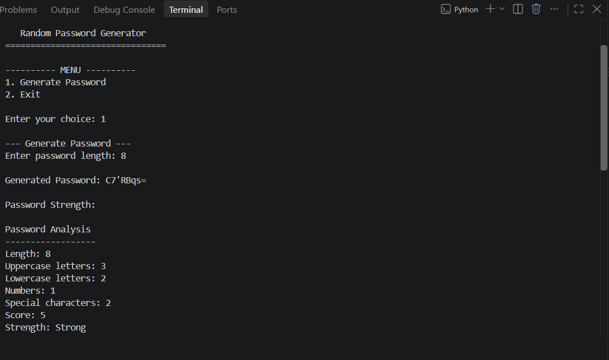
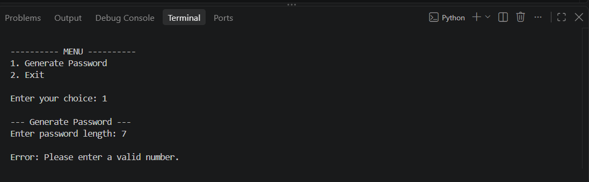
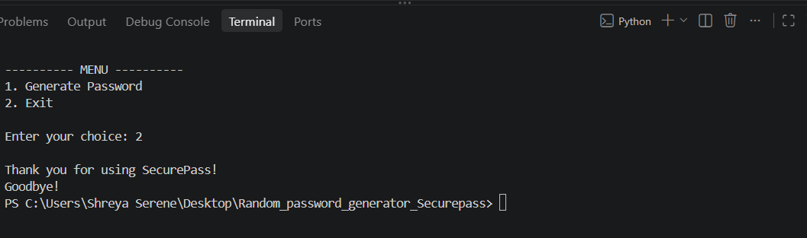

# Random Password Generator – SecurePass

## Project Report

### Submitted By

**Name:** Shreya Serene

**Registration Number:** 26BCE10972

### Programme

B.Tech – Computer Science and Engineering (Core)

### Institution

VIT Bhopal University

### Project Title

**Random Password Generator – SecurePass**

### Subtitle

**A Secure Random Password Generation and Strength Analysis System**

### Technology Used

Python

### Development Environment

Visual Studio Code

### Academic Year

2026–2027

# 2. Introduction

Passwords are an important part of digital security. However,
many users create passwords that are short, simple or easy to
predict. Such passwords can increase the risk of unauthorized
access.

SecurePass is a Python-based Random Password Generator designed
to generate random passwords and provide a basic analysis of their
strength.

The application uses Python's `secrets` module for random character
selection. It combines uppercase letters, lowercase letters,
numbers and special characters to create passwords.

SecurePass also analyzes the generated password by checking its
length and the types of characters it contains. Based on these
characteristics, the application provides a basic strength level.

The project is developed as an educational application to
demonstrate important Python programming concepts such as
functions, loops, conditional statements, strings, lists, modules,
user input and exception handling.

The project uses a simple command-line interface so that the
application remains easy to understand and demonstrate.

# 3. Problem Statement

Many users create passwords that are short, predictable or based on
common words and patterns. Such passwords may provide weaker
protection against unauthorized access.

Manually creating a strong password can also be inconvenient,
especially when users need passwords containing different types of
characters.

Therefore, there is a need for a simple application that can
automatically generate random passwords and provide basic
information about their strength.

SecurePass addresses this problem by:

- Generating random passwords.
- Using uppercase and lowercase letters.
- Including numbers and special characters.
- Allowing the user to specify the password length.
- Analyzing the generated password.
- Providing a basic strength classification.
- Handling invalid password lengths.

The project provides a simple command-line solution while
demonstrating fundamental Python programming concepts.

# 4. Functional Requirements

Functional requirements describe the operations that SecurePass
must perform.

### FR1 – Password Generation

The system shall generate a random password based on the length
provided by the user.

### FR2 – Character Selection

The generated password shall contain:

- Uppercase letters
- Lowercase letters
- Numbers
- Special characters

### FR3 – Secure Random Generation

The system shall use Python's `secrets` module to select random
characters for password generation.

### FR4 – Password Strength Analysis

The system shall analyze the generated password based on:

- Password length
- Uppercase letters
- Lowercase letters
- Numbers
- Special characters

### FR5 – Strength Classification

The system shall classify the generated password as:

- Weak
- Medium
- Strong

### FR6 – Input Validation

The system shall reject password lengths below 8 characters and
display an appropriate error message.

### FR7 – Menu Operation

The system shall provide a simple menu that allows the user to
generate a password or exit the application.

### FR8 – Error Handling

The system shall handle invalid input without terminating
unexpectedly.

# 5. Non-functional Requirements

Non-functional requirements describe the quality and performance
characteristics of the SecurePass application.

### NFR1 – Usability

The application should have a simple command-line interface that
is easy for users to understand and operate.

### NFR2 – Reliability

The application should handle valid and invalid inputs without
unexpectedly terminating.

### NFR3 – Security

The application should use Python's `secrets` module for secure
random character selection.

### NFR4 – Performance

The application should generate passwords quickly without
unnecessary processing.

### NFR5 – Maintainability

The application should use separate modules so that individual
components can be modified and maintained easily.

### NFR6 – Portability

The application should run on systems that have a compatible
Python installation.

### NFR7 – Simplicity

The project should use Python's standard library and should not
depend on unnecessary external packages.

# 6. System Architecture

SecurePass follows a modular architecture. The application is
divided into separate Python modules, with each module responsible
for a specific task.

### Architecture Components

#### 1. User

The user provides the required password length and selects an
operation from the menu.

#### 2. main.py

This is the main control module. It displays the menu, accepts
user input, calls the required functions and displays the results.

#### 3. password_generator.py

This module generates secure random passwords using uppercase
letters, lowercase letters, numbers and special characters.

#### 4. strength_analyzer.py

This module examines the generated password and calculates a basic
strength score.

#### 5. validator.py

This module provides functions for checking whether the supplied
input satisfies basic requirements.

### System Data Flow

```text
User
  │
  ▼
main.py
  │
  ├──────────────► validator.py
  │
  ▼
password_generator.py
  │
  ▼
Generated Password
  │
  ▼
strength_analyzer.py
  │
  ▼
Strength Analysis
  │
  ▼
Display Result

# 7. Design Diagrams

The design of SecurePass is represented using different diagrams
to clearly explain the structure and working of the system.

## 7.1 Use Case Diagram

The use case diagram represents the interaction between the user
and the SecurePass application.

The main use cases are:

- Generate Password
- Analyze Password Strength
- Exit Program

The detailed use case diagram is available in:

`docs/use_case_diagram.md`

## 7.2 Flowchart

The flowchart represents the sequence of operations performed by
SecurePass.

The main process is:

```text
START
  ↓
Display Menu
  ↓
Enter Choice
  ↓
Generate Password
  ↓
Enter Password Length
  ↓
Validate Input
  ↓
Generate Password
  ↓
Analyze Strength
  ↓
Display Result
  ↓
Return to Menu
  ↓
Exit
  ↓
END

# 8. Design Decisions and Rationale

Several design decisions were made during the development of
SecurePass to keep the project secure, simple and easy to maintain.

## 8.1 Python

Python was selected because it provides simple syntax and is
suitable for demonstrating fundamental programming concepts.

## 8.2 Modular Design

The application is divided into separate modules:

- `main.py`
- `password_generator.py`
- `strength_analyzer.py`
- `validator.py`

This separation makes the project easier to understand,
maintain and debug.

## 8.3 Secure Random Generation

The `secrets` module was selected instead of a basic random
generator because it is designed for security-related random
values.

## 8.4 Command-Line Interface

A command-line interface was selected because it is simple to
implement and allows the core Python functionality to remain
the main focus of the project.

## 8.5 Strength Analysis

A basic scoring system was selected to evaluate the password
using its length and character composition.

This provides an easy-to-understand indication of password
strength.

## 8.6 Standard Library

Only Python standard-library modules are used. This keeps the
project lightweight and avoids unnecessary external dependencies.

## 8.7 Future Expansion

The modular structure allows additional features such as a
graphical interface and more detailed password analysis to be
added in future versions.

# 9. Implementation Details

SecurePass is implemented using Python and follows a modular
programming approach. Each module performs a specific task.

## 9.1 Main Program

The `main.py` module controls the overall execution of the
application.

It:

1. Displays the SecurePass title.
2. Displays the main menu.
3. Accepts the user's choice.
4. Takes the required password length.
5. Calls the password generation function.
6. Displays the generated password.
7. Calls the password strength analyzer.
8. Displays the analysis result.
9. Allows the user to exit the program.

## 9.2 Password Generator

The `password_generator.py` module generates random passwords.

The module uses:

- Uppercase letters
- Lowercase letters
- Numbers
- Special characters

Python's `secrets.choice()` function is used to select random
characters.

The program first adds characters from the available character
categories and then fills the remaining positions.

The characters are finally rearranged using secure random
selection.

## 9.3 Password Strength Analyzer

The `strength_analyzer.py` module examines the generated password.

It counts:

- Uppercase letters
- Lowercase letters
- Numbers
- Special characters

The password length is also checked.

A score is calculated using these characteristics and the password
is classified as:

- Weak
- Medium
- Strong

## 9.4 Validator

The `validator.py` module contains basic validation functions.

It checks whether:

- The password length is at least 4.
- At least one character category has been selected.

These functions help prevent invalid input.

## 9.5 Error Handling

The main program uses `try` and `except` to handle invalid
password-length input.

For example, if the user enters text instead of a number, the
program displays an error message instead of terminating
unexpectedly.

## 9.6 Technologies and Libraries

The project uses:

- Python 3
- Visual Studio Code
- `string` module
- `secrets` module

No third-party Python packages are required.

# 10. Screenshots and Results

The SecurePass application was executed in the VS Code terminal
to verify its working and output.

## 10.1 Main Menu


The main menu displays the SecurePass title and provides options
for password generation and exiting the application.

**Screenshot:** Main menu of SecurePass.

## 10.2 Password Generation

The user enters the required password length. SecurePass then
generates a random password using uppercase letters, lowercase
letters, numbers and special characters.

**Screenshot:** Generated password.

## 10.3 Password Strength Analysis

After generating the password, SecurePass analyzes its length and
character composition and displays the corresponding strength
level.

**Screenshot:** Password strength analysis.

## 10.4 Invalid Input


The application also handles invalid password lengths and displays
an appropriate error message.

**Screenshot:** Invalid input handling.

## 10.5 Result 


The screenshots demonstrate that the main functionality of
SecurePass works through the command-line interface.

# 11. Testing Approach

Testing was performed manually to verify the main functions of
the SecurePass application.

The following test cases were used:

| Test Case | Input / Action | Expected Result |
|---|---|---|
| TC01 | Generate password with length 10 | A 10-character password is generated. |
| TC02 | Generate password with length 8 | An 8-character password is generated. |
| TC03 | Enter password length 7 | Error message is displayed. |
| TC04 | Generate a password | Password strength analysis is displayed. |
| TC05 | Enter an invalid menu choice | Invalid choice message is displayed. |
| TC06 | Select Exit | Program terminates successfully. |

The tests confirmed that the main functionality of SecurePass
works correctly for valid and invalid inputs.

---

# 12. Challenges Faced

During the development of SecurePass, several challenges were
encountered.

### 12.1 Random Password Generation

Generating passwords while including different character types
required careful implementation.

### 12.2 Input Validation

The application needed to handle invalid password lengths and
incorrect user input without terminating unexpectedly.

### 12.3 Password Strength Analysis

A simple scoring system had to be designed to evaluate the
different characteristics of a generated password.

### 12.4 Modular Programming

The program was divided into multiple modules so that each module
could perform a specific responsibility.

---

# 13. Learnings and Key Takeaways

The development of SecurePass helped in understanding several
important Python programming concepts.

The major learnings include:

- Creating and using Python functions.
- Dividing a program into multiple modules.
- Working with strings and lists.
- Using loops and conditional statements.
- Handling user input.
- Using exception handling.
- Performing input validation.
- Using the Python `secrets` module for secure random generation.
- Understanding basic software design and documentation.
- Understanding the importance of testing in software development.

The project also provided practical experience in developing a
complete Python application from requirements to implementation
and testing.

---

# 14. Future Enhancements

The current version of SecurePass provides basic password
generation and strength analysis. The following features can be
added in future versions:

- Graphical User Interface (GUI).
- Copy password option.
- More detailed password strength analysis.
- Advanced password validation.
- Custom character selection.
- Additional password security recommendations.

These enhancements can make the application more convenient and
feature-rich.

---

# 15. References

The following resources were used for understanding Python
libraries and concepts used in the project.

1. Python Documentation – Python Standard Library  
   https://docs.python.org/3/

2. Python `secrets` Module Documentation  
   https://docs.python.org/3/library/secrets.html

3. Python `string` Module Documentation  
   https://docs.python.org/3/library/string.html